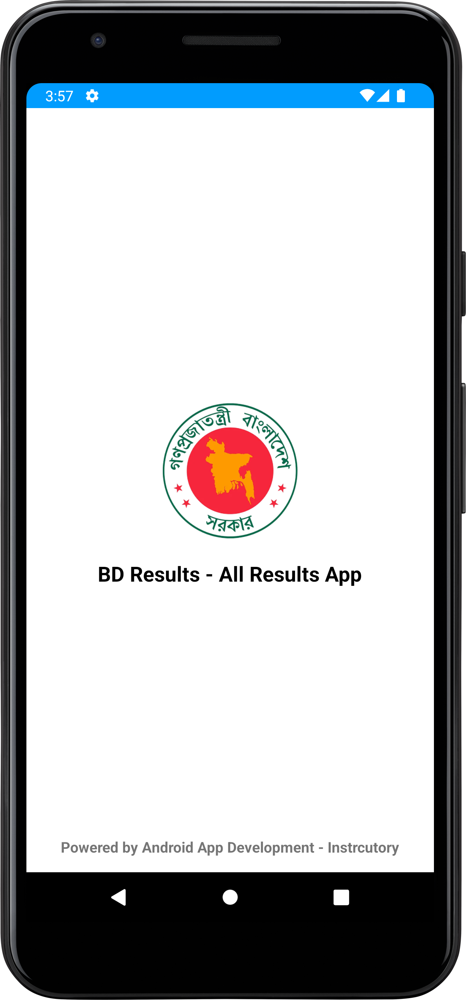
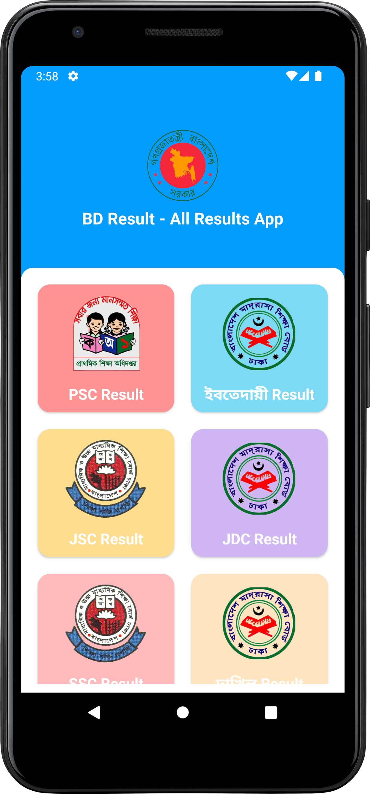
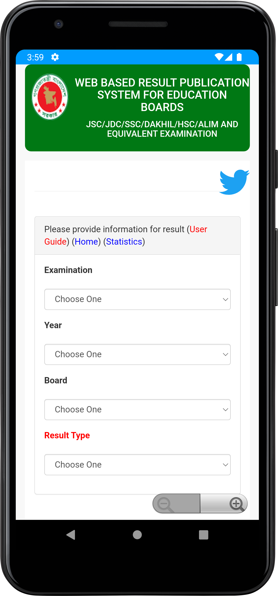

# BD Results App

This is for seeing results of all exam in Bangladesh. To making this app I have use RecyclerView. You can learn make this app using the below playlist video. If you need code you can copy from here. But you don't have right to use this code for selling.

### Download App:

Link: https://terabox.com/s/1nOV3cEwK7eMpR3fe8QPVbw

### BD Results App - Android Project (YouTube PlayList):

Link: https://youtube.com/playlist?list=PLDitZ-MAvK-4xBhXpimaF06S_sawzLXEj

### ANDROID APP DEVELOPMENT COURSE (BANGLE):
Link: https://cutt.ly/oJxeUxL

### Screenshots:

| Splash Screen      |  Home Screen |  WebView Screen |
| :---:       |    :----:   | :----:   |
|        |       |    |

### Disclaimer
This project is made only for educational purpose. Anyone can use it but the risk has to be taken by the user.
for any query please contact me.

### Repository Owner Info

### Md. Al-Amin
##### Junior Software Engineer (Android & iOS) at Rokomari.com

__Email :__ [ alamin.karno@outlook.com ](mailto:alamin.karno@outlook.com)  
__Github :__ [Md. Al-Amin](https://github.com/alamin-karno) 
__Facebook :__ [মোঃ আল-আমিন খন্দকার কর্ণ](https://facebook.com/alamin.kanro786)  
__Linkedin :__ [Md. Alamin Karno](https://www.linkedin.com/in/alaminkarno/)
 
